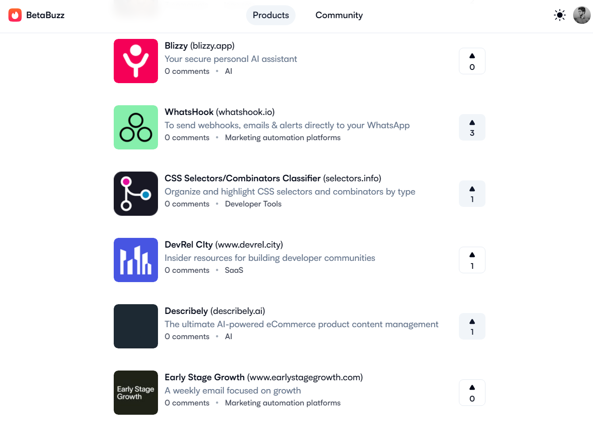
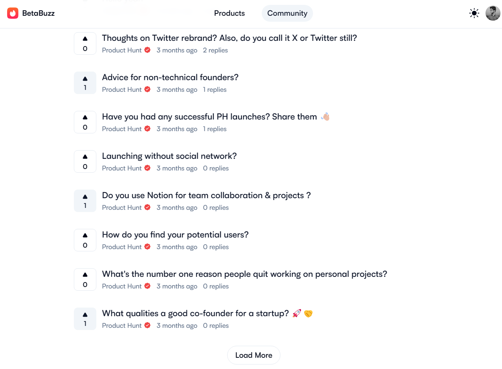
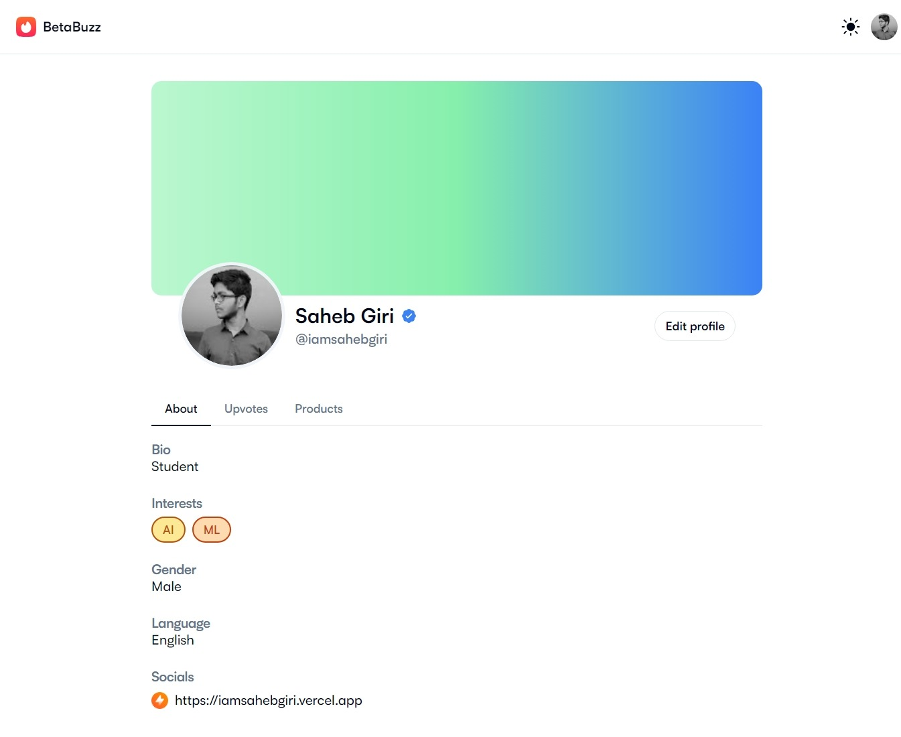
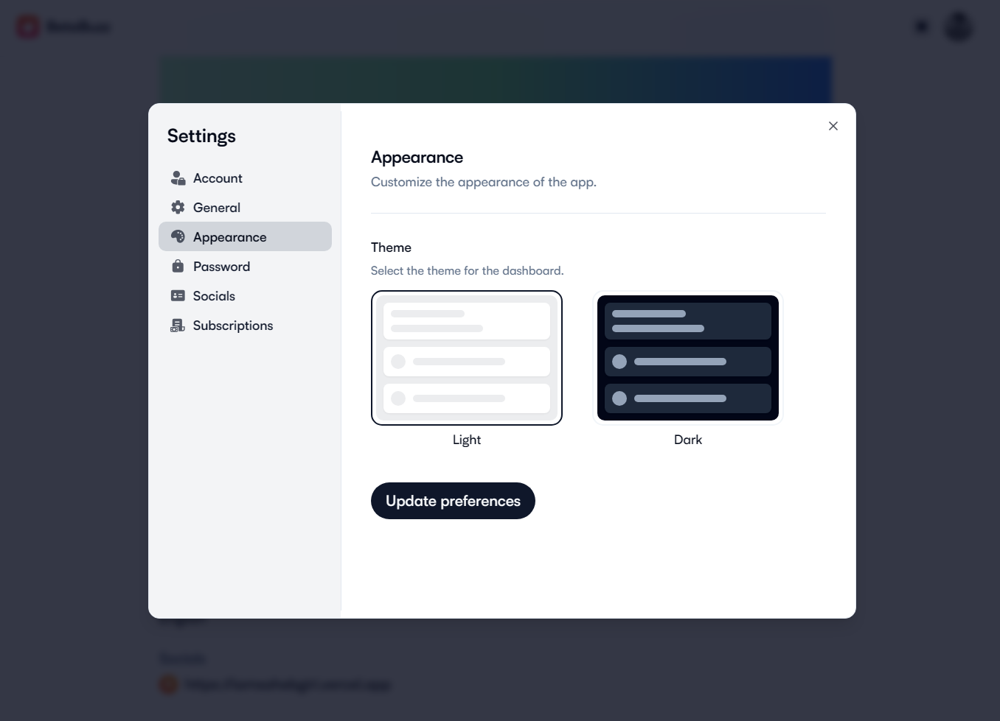
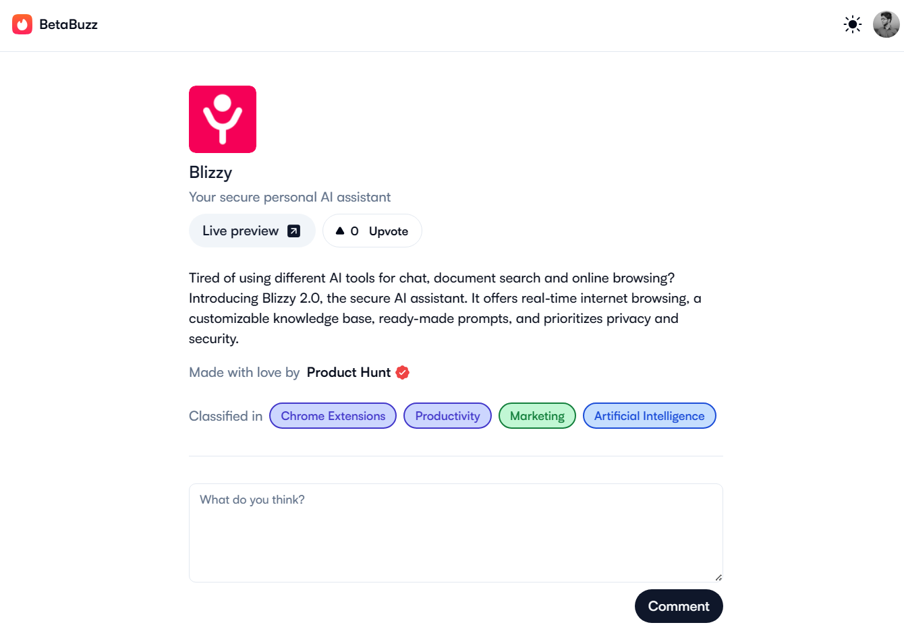
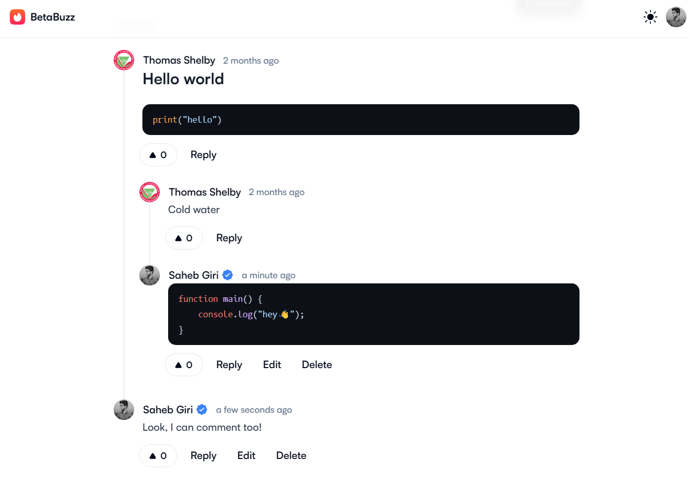

<p align="center">
  <a href="https://github.com/iamsahebgiri/betabuzz">
    
  </a>
</p>
<h1 align="center">BetaBuzz</h1>

<div align="center">
Creating a buzz around the latest beta products
</div>

<br />

<div align="center">
  <a href="https://standardjs.com">
    
  </a>
  
  

  

  

  
</div>

## ⚡️ Introduction

BetaBuzz is website to share and discover new products. Users submit products, which are listed in a linear format. The site includes a comments system and a voting system similar to Hacker News or Reddit.








## 🎯 Features

- JWT Based Authentication
- Storing user generated content in S3
- Stripe integration for subscription (Premium features such as markdown editor, blue tick, etc.)
- Recursive comments (like Reddit, HN) with markdown support

## 📁 Folder

Here's the folder structure of the api and app:

```sh
.
├── api
│   ├── src
│   │   ├── config
│   │   ├── controllers
│   │   ├── docs
│   │   ├── middlewares
│   │   ├── models
│   │   ├── routes
│   │   ├── services
│   │   ├── utils
│   │   └── validations
│   └── tests
│       ├── fixtures
│       ├── integration
│       ├── unit
│       └── utils
└── app
    ├── assets
    ├── components
    ├── config
    ├── hooks
    ├── layouts
    ├── lib
    ├── pages
    ├── public
    ├── services
    ├── styles
    └── types

```

## ⚙️ Installation

Make sure you have [Node.js](https://nodejs.org/en/download/) installed.
Run this followed commands:

To install the api

```bash
# Change directory to api
cd api

# Copy environment variables and Make sure to change them
cp .env.example .env

# Install dependencies (only the first time)
npm install

# Run the local server at localhost:8000
npm run dev
```

To run the web app

```sh
# Change directory to app
cd app
# Install dependencies (only the first time)
npm install

# Run the local server at localhost:3000
npm run dev

# Build for production in the dist/ directory
npm run build
```

## 🌱 Third Party Libraries

- [vercel/next.js](https://github.com/vercel/next.js)
- [expressjs/express](https://github.com/expressjs/express)
- [tailwindlabs/tailwindcss](https://github.com/tailwindlabs/tailwindcss)

## 📚️ Roadmap

- [ ] Login with Google and Github
- [ ] AI Integration for creating product description

## ❤️ Acknowledgements

- [plane](https://github.com/makeplane/plane)

## ‍💻 Author

- [@iamsahebgiri](https://github.com/iamsahebgiri)

## ⭐️ Contribute

If you want to say thank you and/or support the active development of betabuzz:

1. Add a GitHub Star to the project.
2. Tweet about the project on your Twitter.
3. Write a review or tutorial on Medium, Dev.to or personal blog.
4. Support the project by donating a cup of coffee.

## 🧾 License

MIT License Copyright (c) 2023 [Saheb Giri](https://github.com/iamsahebgiri).
